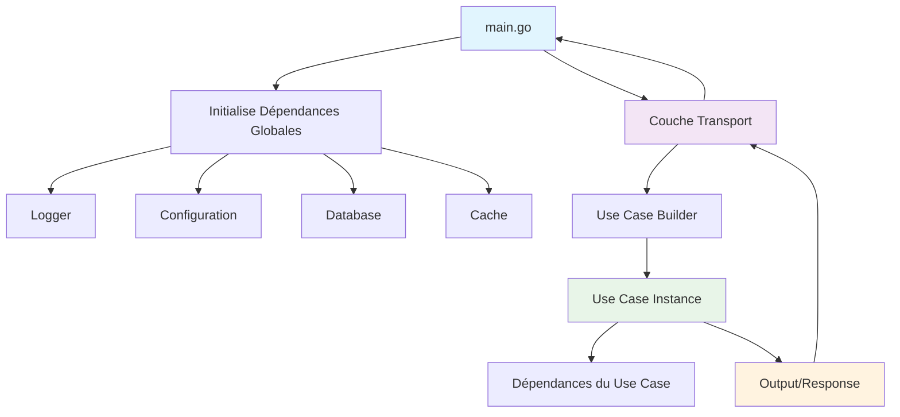

# LiveSemantic - Architecture avec Injection de Dépendances

## 🏗️ Flow d'Exécution



## 📁 Structure Focalisée

```
livesemantic/
├── 📁 cmd/
│   └── server/
│       └── main.go                    # Point d'entrée - Orchestration globale
│
├── 📁 internal/
│   │
│   ├── 📁 domain/                     # 🏢 DOMAIN LAYER
│   │   ├── entities/                  # Entités métier
│   │   ├── services/                  # Services métier 
│   │   └── ports/                     # Interfaces (contracts)
│   │
│   ├── 📁 application/                # 🚀 APPLICATION LAYER
│   │   ├── usecases/                  # Use Cases avec leurs inputs/outputs
│   │   └── dto/                       # DTOs pour communication
│   │
│   ├── 📁 infrastructure/             # 🔌 INFRASTRUCTURE LAYER
│   │   ├── database/                  # Implémentations repositories
│   │   ├── ai/                        # Services IA
│   │   ├── cache/                     # Cache implementations
│   │   └── video/                     # Video processing
│   │
│   └── 📁 transport/                  # 🌐 TRANSPORT LAYER
│       ├── http/                      # HTTP handlers + Use Case builders
│       ├── grpc/                      # gRPC handlers + Use Case builders
│       └── cli/                       # CLI handlers + Use Case builders
│
└── 📁 pkg/                           # Packages utilitaires
    ├── logger/                        # Logger global
    ├── config/                        # Configuration
    └── context/                       # Context applicatif
```

## 🎯 Architecture Détaillée

### 1. Main - Orchestration Globale

```go
// cmd/server/main.go
package main

import (
    "context"
    "log"
    "os"
    "os/signal"
    "syscall"
    
    "github.com/livesemantic/internal/transport/http"
    "github.com/livesemantic/pkg/config"
    "github.com/livesemantic/pkg/logger"
    "github.com/livesemantic/pkg/context"
)

func main() {
    // 1. Initialiser les dépendances globales
    deps, err := initGlobalDependencies()
    if err != nil {
        log.Fatal("Failed to initialize dependencies:", err)
    }
    defer deps.Close()
    
    // 2. Créer le contexte applicatif
    appCtx := context.NewAppContext(deps.Logger, deps.Config)
    
    // 3. Initialiser la couche transport
    httpTransport := http.NewTransport(deps, appCtx)
    
    // 4. Démarrer le serveur
    server := httpTransport.CreateServer()
    
    // 5. Gestion graceful shutdown
    go func() {
        if err := server.Start(); err != nil {
            deps.Logger.Fatal("Server failed to start", "error", err)
        }
    }()
    
    // 6. Attendre signal d'arrêt
    waitForShutdown(appCtx, server, deps.Logger)
}

// GlobalDependencies contient toutes les dépendances globales
type GlobalDependencies struct {
    Logger     logger.Logger
    Config     *config.Config
    Database   *sql.DB
    Cache      cache.Client
    AI         ai.Service
    VideoProc  video.Service
    Storage    storage.Service
}

func initGlobalDependencies() (*GlobalDependencies, error) {
    // Initialiser config
    cfg, err := config.Load()
    if err != nil {
        return nil, err
    }
    
    // Initialiser logger
    logger := logger.New(cfg.Logger)
    
    // Initialiser database
    db, err := database.Connect(cfg.Database)
    if err != nil {
        return nil, err
    }
    
    // Initialiser cache
    cache, err := cache.New(cfg.Cache)
    if err != nil {
        return nil, err
    }
    
    // Initialiser services IA
    aiService, err := ai.New(cfg.AI)
    if err != nil {
        return nil, err
    }
    
    // Initialiser service vidéo
    videoService, err := video.New(cfg.Video)
    if err != nil {
        return nil, err
    }
    
    // Initialiser storage
    storageService, err := storage.New(cfg.Storage)
    if err != nil {
        return nil, err
    }
    
    return &GlobalDependencies{
        Logger:    logger,
        Config:    cfg,
        Database:  db,
        Cache:     cache,
        AI:        aiService,
        VideoProc: videoService,
        Storage:   storageService,
    }, nil
}

func (d *GlobalDependencies) Close() {
    d.Database.Close()
    d.Cache.Close()
    d.AI.Close()
    d.VideoProc.Close()
    d.Storage.Close()
}

func waitForShutdown(ctx context.AppContext, server *http.Server, logger logger.Logger) {
    quit := make(chan os.Signal, 1)
    signal.Notify(quit, syscall.SIGINT, syscall.SIGTERM)
    
    <-quit
    logger.Info("Shutting down server...")
    
    if err := server.Shutdown(); err != nil {
        logger.Error("Server forced to shutdown", "error", err)
    }
    
    logger.Info("Server exited")
}
```

### 2. Transport Layer - Création des Use Cases

```go
// internal/transport/http/transport.go
package http

import (
    "github.com/gin-gonic/gin"
    "github.com/livesemantic/internal/application/usecases"
    "github.com/livesemantic/pkg/context"
)

type Transport struct {
    deps   *GlobalDependencies  // Dépendances globales du main
    appCtx context.AppContext    // Contexte applicatif
    router *gin.Engine
}

func NewTransport(deps *GlobalDependencies, appCtx context.AppContext) *Transport {
    return &Transport{
        deps:   deps,
        appCtx: appCtx,
        router: gin.New(),
    }
}

func (t *Transport) CreateServer() *Server {
    // Enregistrer les routes qui créent les use cases
    t.registerRoutes()
    
    return &Server{
        router: t.router,
        config: t.deps.Config,
        logger: t.deps.Logger,
    }
}

func (t *Transport) registerRoutes() {
    api := t.router.Group("/api/v1")
    
    // Routes vidéo - chaque route crée son use case
    video := api.Group("/video")
    {
        video.POST("/process", t.handleVideoProcess)
        video.GET("/sources", t.handleGetVideoSources)
        video.POST("/sources", t.handleCreateVideoSource)
    }
    
    // Routes filtres
    filters := api.Group("/filters")
    {
        filters.POST("/", t.handleCreateFilter)
        filters.GET("/", t.handleGetFilters)
        filters.PUT("/:id", t.handleUpdateFilter)
        filters.DELETE("/:id", t.handleDeleteFilter)
    }
    
    // Routes matching
    matching := api.Group("/matching")
    {
        matching.POST("/process", t.handleProcessMatching)
        matching.GET("/recent", t.handleGetRecentMatches)
        matching.GET("/search", t.handleSearchMatches)
    }
    
    // WebSocket pour temps réel
    api.GET("/ws", t.handleWebSocket)
}
```

### 3. Handlers - Builders de Use Cases

```go
// internal/transport/http/video_handlers.go
package http

import (
    "net/http"
    "github.com/gin-gonic/gin"
    "github.com/livesemantic/internal/application/usecases/video_processing"
    "github.com/livesemantic/internal/application/dto"
    "github.com/livesemantic/internal/infrastructure/database/postgres"
    "github.com/livesemantic/internal/infrastructure/ai/clip"
)

// handleVideoProcess crée et exécute le use case de traitement vidéo
func (t *Transport) handleVideoProcess(c *gin.Context) {
    // 1. Parser la requête
    var request dto.ProcessVideoRequest
    if err := c.ShouldBindJSON(&request); err != nil {
        c.JSON(http.StatusBadRequest, gin.H{"error": err.Error()})
        return
    }
    
    // 2. Créer les dépendances spécifiques au use case
    frameRepo := postgres.NewFrameRepository(t.deps.Database, t.deps.Logger)
    sourceRepo := postgres.NewVideoSourceRepository(t.deps.Database, t.deps.Logger)
    aiService := clip.NewService(t.deps.AI, t.deps.Logger)
    
    // 3. Créer le use case avec ses dépendances
    useCase := video_processing.NewProcessVideoUseCase(
        frameRepo,
        sourceRepo, 
        aiService,
        t.deps.Logger,
    )
    
    // 4. Exécuter le use case
    input := video_processing.ProcessVideoInput{
        SourceID:  request.SourceID,
        VideoData: request.VideoData,
        Options:   request.Options,
    }
    
    output := useCase.Execute(c.Request.Context(), input)
    
    // 5. Retourner la réponse
    if output.Error != nil {
        t.appCtx.Logger.Error("Video processing failed", "error", output.Error)
        c.JSON(http.StatusInternalServerError, gin.H{"error": output.Error.Error()})
        return
    }
    
    response := dto.ProcessVideoResponse{
        ProcessingID: output.ProcessingID,
        FramesCount:  output.FramesExtracted,
        Status:       output.Status,
        Message:      "Video processing started successfully",
    }
    
    c.JSON(http.StatusOK, response)
}

// handleCreateFilter crée et exécute le use case de création de filtre
func (t *Transport) handleCreateFilter(c *gin.Context) {
    // 1. Parser la requête
    var request dto.CreateFilterRequest
    if err := c.ShouldBindJSON(&request); err != nil {
        c.JSON(http.StatusBadRequest, gin.H{"error": err.Error()})
        return
    }
    
    // 2. Créer les dépendances du use case
    filterRepo := postgres.NewFilterRepository(t.deps.Database, t.deps.Logger)
    aiService := clip.NewService(t.deps.AI, t.deps.Logger)
    validationService := services.NewFilterValidationService()
    
    // 3. Créer le use case
    useCase := filter_management.NewCreateFilterUseCase(
        filterRepo,
        aiService,
        validationService,
        t.deps.Logger,
    )
    
    // 4. Exécuter
    input := filter_management.CreateFilterInput{
        Name:        request.Name,
        Description: request.Description,
        Query:       request.Query,
        Threshold:   request.Threshold,
        UserID:      request.UserID,
    }
    
    output := useCase.Execute(c.Request.Context(), input)
    
    // 5. Réponse
    if output.Error != nil {
        c.JSON(http.StatusBadRequest, gin.H{"error": output.Error.Error()})
        return
    }
    
    response := dto.CreateFilterResponse{
        FilterID:    output.FilterID,
        Name:        output.Name,
        Status:      "created",
        EmbeddingID: output.EmbeddingID,
    }
    
    c.JSON(http.StatusCreated, response)
}

// handleProcessMatching crée et exécute le use case de matching
func (t *Transport) handleProcessMatching(c *gin.Context) {
    // 1. Parser la requête
    var request dto.ProcessMatchingRequest
    if err := c.ShouldBindJSON(&request); err != nil {
        c.JSON(http.StatusBadRequest, gin.H{"error": err.Error()})
        return
    }
    
    // 2. Créer les dépendances
    frameRepo := postgres.NewFrameRepository(t.deps.Database, t.deps.Logger)
    filterRepo := postgres.NewFilterRepository(t.deps.Database, t.deps.Logger)
    matchRepo := postgres.NewMatchRepository(t.deps.Database, t.deps.Logger)
    similarityService := services.NewSimilarityService()
    matchingService := services.NewMatchingService(similarityService)
    
    // 3. Créer le use case
    useCase := matching.NewProcessMatchingUseCase(
        frameRepo,
        filterRepo,
        matchRepo,
        matchingService,
        t.deps.Logger,
    )
    
    // 4. Exécuter
    input := matching.ProcessMatchingInput{
        FrameIDs:  request.FrameIDs,
        FilterIDs: request.FilterIDs,
        Options:   request.Options,
    }
    
    output := useCase.Execute(c.Request.Context(), input)
    
    // 5. Réponse
    if output.Error != nil {
        c.JSON(http.StatusInternalServerError, gin.H{"error": output.Error.Error()})
        return
    }
    
    response := dto.ProcessMatchingResponse{
        MatchesFound:   output.MatchesCount,
        ProcessingTime: output.ProcessingTime,
        Matches:        output.Matches,
        Status:         "completed",
    }
    
    c.JSON(http.StatusOK, response)
}
```

### 4. Use Cases - Business Logic Pure

```go
// internal/application/usecases/video_processing/process_video.go
package video_processing

import (
    "context"
    "time"
    "github.com/google/uuid"
    "github.com/livesemantic/internal/domain/entities"
    "github.com/livesemantic/internal/domain/ports"
    "github.com/livesemantic/pkg/logger"
)

// ProcessVideoUseCase - Use case indépendant avec ses dépendances
type ProcessVideoUseCase struct {
    frameRepo  ports.FrameRepository
    sourceRepo ports.VideoSourceRepository  
    aiService  ports.AIService
    logger     logger.Logger
}

// Constructor - Injection de dépendances
func NewProcessVideoUseCase(
    frameRepo ports.FrameRepository,
    sourceRepo ports.VideoSourceRepository,
    aiService ports.AIService,
    logger logger.Logger,
) *ProcessVideoUseCase {
    return &ProcessVideoUseCase{
        frameRepo:  frameRepo,
        sourceRepo: sourceRepo,
        aiService:  aiService,
        logger:     logger,
    }
}

// Input du use case
type ProcessVideoInput struct {
    SourceID  uuid.UUID
    VideoData []byte
    Options   ProcessingOptions
}

type ProcessingOptions struct {
    FPS             int
    MaxFrames       int
    StartTime       time.Duration
    EndTime         time.Duration
    GenerateEmbeddings bool
}

// Output du use case
type ProcessVideoOutput struct {
    ProcessingID    uuid.UUID
    FramesExtracted int
    Status          string
    Error           error
}

// Execute - Point d'entrée du use case
func (uc *ProcessVideoUseCase) Execute(ctx context.Context, input ProcessVideoInput) ProcessVideoOutput {
    processingID := uuid.New()
    
    uc.logger.Info("Starting video processing", 
        "processing_id", processingID,
        "source_id", input.SourceID)
    
    // 1. Valider la source vidéo
    source, err := uc.sourceRepo.GetByID(ctx, input.SourceID)
    if err != nil {
        return ProcessVideoOutput{
            ProcessingID: processingID,
            Error:        fmt.Errorf("failed to get video source: %w", err),
        }
    }
    
    if !source.IsActive() {
        return ProcessVideoOutput{
            ProcessingID: processingID,
            Error:        fmt.Errorf("video source is not active"),
        }
    }
    
    // 2. Extraire les frames
    frames, err := uc.extractFrames(ctx, input.VideoData, input.Options)
    if err != nil {
        return ProcessVideoOutput{
            ProcessingID: processingID,
            Error:        fmt.Errorf("failed to extract frames: %w", err),
        }
    }
    
    // 3. Sauvegarder les frames
    for _, frame := range frames {
        if err := uc.frameRepo.Save(ctx, frame); err != nil {
            uc.logger.Error("Failed to save frame", "error", err, "frame_id", frame.ID)
            continue
        }
    }
    
    // 4. Générer les embeddings si demandé (async)
    if input.Options.GenerateEmbeddings {
        go uc.processEmbeddingsAsync(context.Background(), frames)
    }
    
    uc.logger.Info("Video processing completed", 
        "processing_id", processingID,
        "frames_extracted", len(frames))
    
    return ProcessVideoOutput{
        ProcessingID:    processingID,
        FramesExtracted: len(frames),
        Status:          "completed",
        Error:           nil,
    }
}

// Méthodes privées du use case
func (uc *ProcessVideoUseCase) extractFrames(ctx context.Context, videoData []byte, options ProcessingOptions) ([]*entities.Frame, error) {
    // Logique d'extraction des frames
    // Utilise les services injectés
    return nil, nil
}

func (uc *ProcessVideoUseCase) processEmbeddingsAsync(ctx context.Context, frames []*entities.Frame) {
    for _, frame := range frames {
        embedding, err := uc.aiService.GenerateImageEmbedding(ctx, frame.ToImage())
        if err != nil {
            uc.logger.Error("Failed to generate embedding", "error", err, "frame_id", frame.ID)
            continue
        }
        
        if err := uc.frameRepo.UpdateEmbedding(ctx, frame.ID, embedding); err != nil {
            uc.logger.Error("Failed to update embedding", "error", err, "frame_id", frame.ID)
        }
    }
}
```

### 5. DTOs - Communication entre couches

```go
// internal/application/dto/requests/video_processing.go
package requests

import (
    "time"
    "github.com/google/uuid"
)

type ProcessVideoRequest struct {
    SourceID  uuid.UUID         `json:"source_id" binding:"required"`
    VideoData []byte            `json:"video_data" binding:"required"`
    Options   ProcessingOptions `json:"options"`
}

type ProcessingOptions struct {
    FPS                int           `json:"fps" default:"5"`
    MaxFrames          int           `json:"max_frames" default:"1000"`
    StartTime          time.Duration `json:"start_time"`
    EndTime            time.Duration `json:"end_time"`
    GenerateEmbeddings bool          `json:"generate_embeddings" default:"true"`
}

// internal/application/dto/responses/video_processing.go
package responses

import "github.com/google/uuid"

type ProcessVideoResponse struct {
    ProcessingID uuid.UUID `json:"processing_id"`
    FramesCount  int       `json:"frames_count"`
    Status       string    `json:"status"`
    Message      string    `json:"message"`
}
```

## 🔄 Flow d'Exécution Complet

1. **Main** : Initialise toutes les dépendances globales (DB, Cache, AI, etc.)
2. **Main** : Crée le contexte applicatif 
3. **Main** : Initialise la couche Transport avec les dépendances
4. **Transport** : Enregistre les routes HTTP
5. **Handler** : Reçoit une requête HTTP
6. **Handler** : Crée les dépendances spécifiques au Use Case
7. **Handler** : Instancie le Use Case avec ses dépendances
8. **Handler** : Exécute le Use Case
9. **Use Case** : Exécute la logique métier
10. **Use Case** : Retourne un Output structuré
11. **Handler** : Transforme l'Output en réponse HTTP
12. **Transport** : Retourne la réponse au client

## 🎯 Avantages de cette Architecture

- **Séparation claire** : Chaque couche a sa responsabilité
- **Injection de dépendances** : Facilite les tests et la maintenance
- **Use Cases indépendants** : Chaque use case peut avoir ses propres dépendances
- **Réutilisabilité** : Les use cases peuvent être appelés depuis différents transports
- **Testabilité** : Chaque couche peut être testée indépendamment
- **Évolutivité** : Facile d'ajouter de nouveaux transports ou use cases